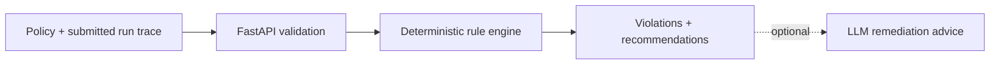

# LangGraph Governance Lab

A Python/FastAPI evaluation service for agent run traces, designed around the governance needs of LangGraph and multi-agent workflows. Deterministic policy results remain separate from optional LLM-generated remediation advice.

## Problem and architecture

Agent runs need inspectable checks for restricted tools, missing approvals, model choices, step budgets, and costs. This service evaluates the submitted trace and returns structured findings.



**Design choices:** Rules decide compliance; generative advice cannot override them. Evaluation can run singly or in batches. The trace carries tool/model/approval state; this service does not execute agents or maintain their graph state.

**Stack:** Python, FastAPI, Requests, pytest, Docker. LangGraph is the intended integration context, not an installed runtime dependency or an implemented graph runner.

## What this service provides

- Governance policy validation endpoint.
- Agent run evaluation endpoint with deterministic policy checks.
- Batch run evaluation endpoint for experiment suites.
- Optional LLM-generated remediation advice.
- Optional API key protection and configurable rate limiting.

## Quick start

Run locally:

```bash
cd langgraph-governance-lab
python -m pip install -r requirements.txt
uvicorn server:app --reload --port 8003
```

Evaluate a sample run:

```bash
curl -s -X POST "http://127.0.0.1:8003/governance/evaluate" \
  -H "Content-Type: application/json" \
  -d @examples/sample_run.json
```

Validate a policy:

```bash
curl -s -X POST "http://127.0.0.1:8003/policies/validate" \
  -H "Content-Type: application/json" \
  -d '{"policy":{"name":"strict","max_steps":30,"blocked_tools":["shell.exec"],"approval_required_tools":["wire_transfer"],"allowed_models":["gpt-4o-mini"],"max_total_cost_usd":0.5}}'
```

## Configuration

Environment variables:

You can start from `.env.example` and override values per environment.

- `GOV_API_HOST` (default: `0.0.0.0`)
- `GOV_API_PORT` (default: `8003`)
- `GOV_API_LOG_LEVEL` (default: `INFO`)
- `GOV_API_KEY` (optional; if set, required via `X-API-Key`)
- `GOV_REQUEST_LOGGING` (default: `true`)
- `GOV_RATE_LIMIT_ENABLED` (default: `false`)
- `GOV_RATE_LIMIT_REQUESTS_PER_MINUTE` (default: `120`)
- `GOV_RATE_LIMIT_WINDOW_SECONDS` (default: `60`)
- `GOV_RATE_LIMIT_EXEMPT_PATHS` (default: `/health,/ready`)
- `GOV_LLM_URL` (optional; enables LLM remediation advice)
- `GOV_LLM_TIMEOUT_SECONDS` (default: `10`)
- `GOV_LLM_RETRIES` (default: `2`)
- `GOV_MAX_STEPS_CAP` (default: `2000`)

## Docs

- Design: `docs/design.md`
- API: `docs/api.md`
- Operations: `docs/operations.md`
- Deployment: `docs/deployment.md`
- Security: `docs/security.md`
- Evaluation: `docs/evaluation.md`

## Testing and quality

```bash
python -m pip install -r requirements-dev.txt
python -m pytest -q
python -m flake8 .
```

CI runs on push/PR and executes lint + tests on Python 3.10 and 3.11.

## Evaluation, limitations, and roadmap

The test suite covers policy validation, deterministic violations, API responses, and rate limiting. See [evaluation](docs/evaluation.md) for the evaluation approach and [design](docs/design.md) for service boundaries.

- Evaluation relies on submitted trace metadata, including recorded approvals and costs.
- A compliant trace is not proof of truthful model output or safe real-world behavior.
- This service does not intercept tool calls, enforce permissions during execution, or run a multi-agent graph. Enforcement must be integrated with the caller.
- Optional LLM advice is advisory and depends on an upstream endpoint.
- In-memory limits and optional API keys do not establish production readiness.

Future integration work includes connecting checks to an executing graph and validating failure paths with representative traces. These are next steps, not implemented capabilities. Deployment considerations are in [operations](docs/operations.md) and [security](docs/security.md).

## License

See [LICENSE](LICENSE) for the repository license.
